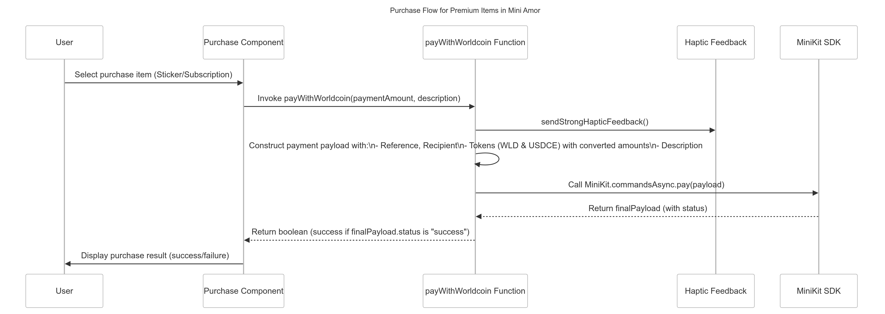

# Mini Amor - Web3-Powered Dating Mini App

Mini Amor is a revolutionary dating application built within the World App ecosystem that prioritizes authenticity and security through Web3 technology. By leveraging World ID for authentication, Mini Amor ensures that all users are real humans, creating a safer and more genuine dating environment.

<div align="center">
  <h1>📱 Scan this QR code in World App to open Mini Amor</h1>
  
  <p><strong>⬆️ Open World App and scan this QR code to get started! ⬆️</strong></p>
</div>

---
## 🌟 Key Features

### 🔐 Secure Authentication
- **World ID Integration**: Verify your humanity through World ID's proof of personhood system
- **MetaMask Connection**: Connect your Web3 wallet for future blockchain-based features
- **Sybil-Resistant**: Prevents fake accounts and bots, ensuring authentic interactions

### 💝 Core Dating Features
- **Profile Creation**: Build your unique dating profile
- **Send Sticker Gifts: Send free or paid stickers to your match to show you your interest for them
- **Swipe Interface**: Intuitive swipe mechanism to find potential matches
- **Matching System**: Connect with users who share mutual interest
- **Chat System**: Communicate with your matches securely

### 💫 Advanced Features
- **MiniKit Integration**:
  - User Verification
  - Secure Payment Processing
  - Digital Signatures for enhanced security

## 🛠️ Technical Stack

- **Frontend Framework**: Next.js 15.2
- **UI Components**: 
  - Radix UI for accessible components
  - Tailwind CSS for styling
  - Custom animations and transitions
- **Web3 Integration**:
  - World ID / MiniKit for authentication
  - MetaMask for wallet connection
  - Ethers.js for blockchain interactions
- **State Management**: React Hooks and Contexts
- **Form Handling**: React Hook Form with Zod validation
- **Type Safety**: TypeScript throughout the application

## 🚀 Getting Started

### Prerequisites
Before you begin, ensure you have the following installed:
- Node.js (Latest LTS version)
- NPM package manager
- Git
- MetaMask wallet extension
- World ID account
- NGrok (for local development)

### Detailed Installation Guide

#### 1. Clone the Repository
```bash
git clone [repository-url] mini-amor
cd mini-amor
```

#### 2. Install Dependencies
Install the necessary dependencies using NPM with legacy peer dependencies:
```bash
npm install --legacy-peer-deps
```

#### 3. Set up Environment Variables
```bash
cp .env.example .env
```
Fill in the required environment variables:
- NEXT_PUBLIC_WORLD_ID_APP_ID
- NEXT_PUBLIC_WORLD_ID_ACTION_NAME
- [Other required environment variables]

#### 4. Start the Local Server
Run the development server:
```bash
npm run dev
```
Your app should now be running on http://localhost:3000

#### 5. NGrok Setup (for Public Access)
To expose your local server to the internet:

1. Install NGrok if you haven't already
2. Create a tunnel to your localhost:
```bash
ngrok http <local server link>
```
3. Save the public NGrok link provided for API access

#### 6. Developer Account Setup
1. Create an account on the developer portal
2. Create a new mini app
3. Copy the provided app ID
4. Configure the app ID in your mini app's configuration page


#### 7. Configure Incognito Actions (Critical)
Important configuration steps:
- Create incognito actions with exact specified names (e.g., "verify-dating")
- Enable unlimited verifications per user for testing purposes


#### 8. Launch Options

**Local Development (via QR)**
- Use the developer preview feature
- Scan the QR code to launch your local version


**Live Deployment**
- Access the production version via mini app QR code
- Note: This won't allow launching your own version

## 🔒 Security Features

- Secure authentication flow using World ID
- Protected routes for verified users only
- Encrypted communication channels
- Secure payment processing through MiniKit
- Digital signature verification for important actions

## 🌐 World App Ecosystem Integration

Mini Amor is designed to be a seamless part of the World App ecosystem:
- Leverages World ID for sybil-resistant authentication
- Integrates MiniKit for various secure operations
- Prepared for future cross-platform and cross-chain features
- Built with scalability and interoperability in mind

## 🛣️ Roadmap

- [ ] Additional blockchain network support
- [ ] Enhanced matching algorithms
- [ ] Advanced filtering options
- [ ] Premium features marketplace
- [ ] Community governance features
- [ ] Cross-platform mobile applications

## 👥 Contributing

We welcome contributions to Mini Amor! Please read our contributing guidelines before submitting pull requests.

## 📊 Technical Workflow Diagrams
Mini Amor's architecture leverages Web3 technology and the World App ecosystem through several interconnected processes. Below we provide detailed technical diagrams that illustrate the core workflows powering our application.

### Verification & Authentication Flows

The verification flow diagram illustrates the complete authentication process between the user, our VerifyHumanity component, MiniKit (WorldCoin), and our backend API. This sequence diagram shows exactly how proof of personhood is established through World ID, from the initial user click through to successful verification and navigation.

### Complete App User Journey

This comprehensive flowchart maps the entire user journey through Mini Amor, starting from app launch through verification, and branching into three core paths:

Premium & Stickers: How users access and purchase premium features
Profile Setup: The profile creation and on-chain verification process
Discovery & Swiping: The matching system and communication flows

### Premium Features Purchase Flow

The purchase sequence diagram details how payments are processed within Mini Amor using WorldCoin. It demonstrates the interaction between the user interface, payment processing functions, haptic feedback, and the MiniKit SDK to ensure secure, verifiable transactions.

### Profile Editing & Smart Contract Verification

This diagram illustrates how user profile data is cryptographically signed and verified on-chain through the Flow blockchain. The sequence demonstrates the entire process from editing profile information through signature validation and smart contract interaction.